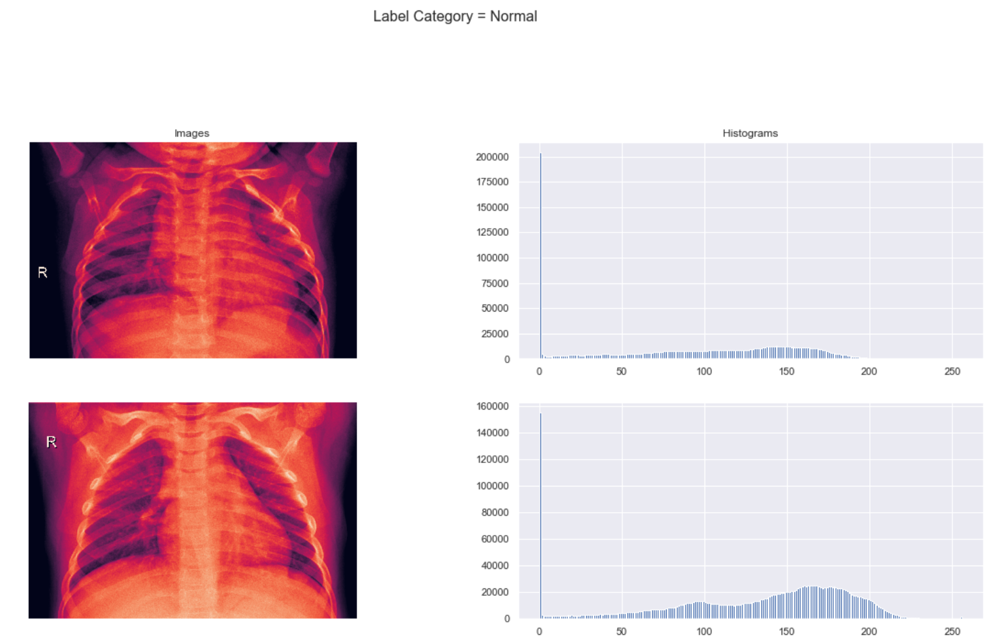
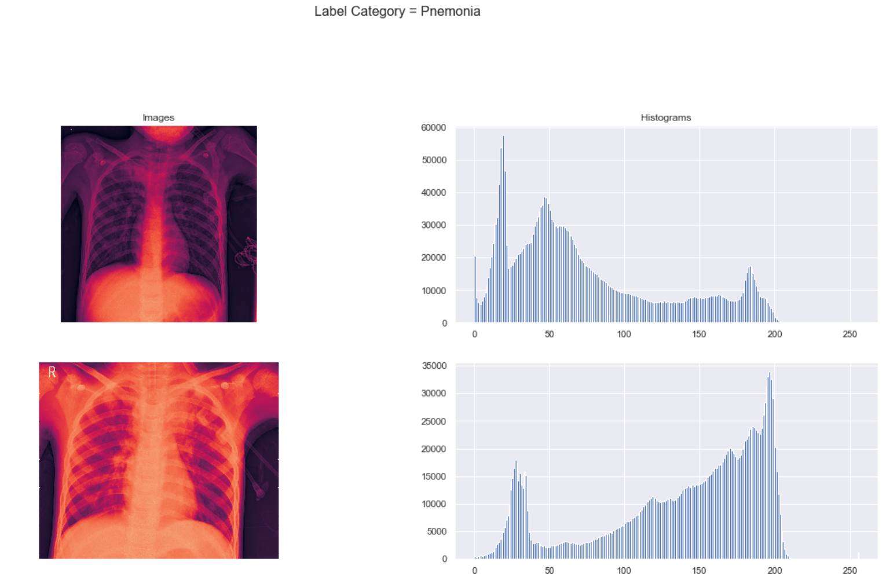
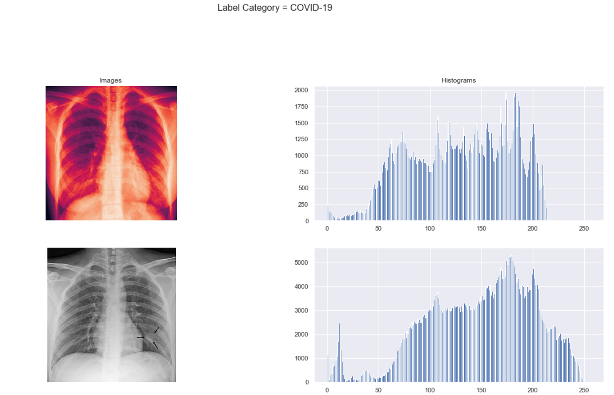
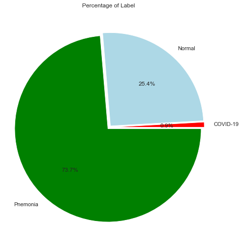
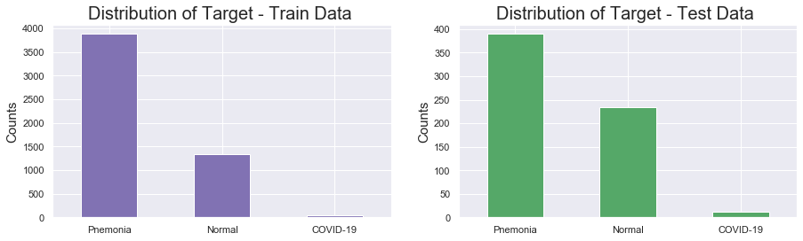
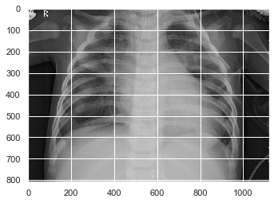
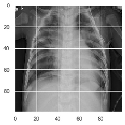
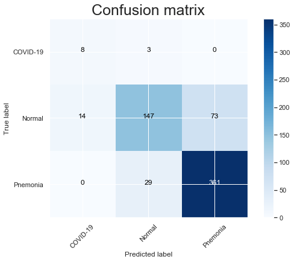

# COVID_19_chest_CT_Image_Classification

# Goal:

The goal of this project is using the patients' chest CT images to predict if a patient has pneumonia caused by COVID-19 , normal or has other pneumonia . This is ternary classification analysis.

# Data Source :
https://www.kaggle.com/praveengovi/coronahack-chest-xraydataset
# Data Cleansing 
- There are three different labels which implies three different target, but last two contain so much None and incomplete information, so I combined  two columns’ information to get my target.
- This data needs to be cleaned first, because the metadata (target label) does not really match the images in the train data folder .  I removed the images which are not in the metadata (target label) ( the images’ names  in the train folder must match and the images in the train data folder).
- The train data contains all COVID_19 patients but there are no COVID_19 images in test data so I moved 20% of COVID_19 images from the train folder into the test data folder.

# EDA 
 We can see the difference between COVID-19 pneumonia , normal or other pneumonia . Normal ones are very obvious, the histogram shows they are very smooth, on the other hand the histograms of  COVID_19 pneumonia and other type pneumonia  show more  fluctuations. 
 (code source:https://www.kaggle.com/adityam1311/covid-19-x-ray-images-eda-models)

 
# Data Pre-processing
- Oversampling method was applied, bar chart shows that those classes are not balanced.
- Load the images  and resize them
- Normalized Image data
- Reshaped  image data and train and test labels(target) 

# Modeling
- Neural Network ( early stop, regularization )
- Random Forest ( GridSearch)
# Model Evaluation
Neural Network performed the best 
- Training Accuracy: 0.9781
- Testing Accuracy:  0.8173
- Train data f1_Score:0.9781282284242644
- Test data f1_Score:0.8072066074203615
 

